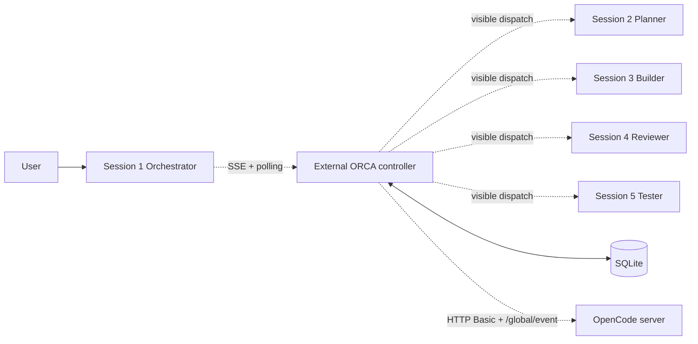
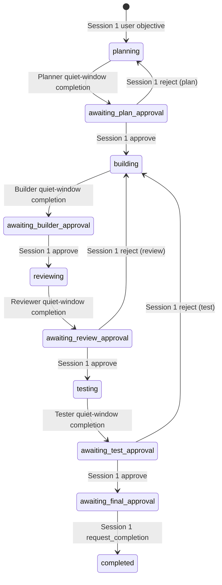

# ORCA Architecture

## 1. Executive Summary

**Status:** ORCA is a controller-first OpenCode orchestration system proven end-to-end against a production-composed fake OpenCode adapter. The five-session mission workflow (Session 1 Orchestrator → Session 2 Planner → Session 3 Builder → Session 4 Reviewer → Session 5 Tester → explicit Session 1 final completion) is exercised by `tests/e2e/fake-complete-mission.test.ts` through the real `startController()` composition and `EventRuntime`. Live validation runs only inside an isolated worktree and remains the final acceptance gate.

The remaining live-validation limitations are:

- A reachable authenticated OpenCode server (configurable via `ORCA_OPENCODE_URL`, `ORCA_OPENCODE_USERNAME`, `ORCA_OPENCODE_PASSWORD`).
- Exactly five manually opened OpenCode sessions paired in the isolated worktree before `verify:release`.
- Manual answer of any permission prompts during the live run (the controller blocks on permission requests until they are resolved).
- One sentinel documentation change is written under `.orca/` to prove the live test mutates the worktree; the test never auto-commits, pushes, resets, or deletes user files.

## 2. Intended System Model

ORCA is an external controller that coordinates five manually opened OpenCode sessions in one repository:

| Session | Role       | Reads / Writes                                          |
| ------- | ---------- | ------------------------------------------------------- |
| 1       | Orchestrator | Reads/writes only Session 1 chat; never project files  |
| 2       | Planner     | Read-only on the workspace                              |
| 3       | Builder     | Writes project files; reads everything else             |
| 4       | Reviewer    | Read-only; emits a structured review verdict            |
| 5       | Tester      | Read-only; emits a structured test verdict             |

The user selects each session's model; ORCA preserves the model and never changes it. The controller observes Session 1, ingests the user objective, dispatches visible work to Sessions 2–5, asks Session 1 for correlated decisions, and enforces Plan → Build → Review → Test → explicit final approval in code. Only the Builder may modify project files; workers must not communicate directly. Review and test failures route back to the Builder; new Builder work invalidates stale review/test approvals.

## 3. Current Repository Structure

```
src/cli/main.ts                 commander program: doctor, pair, status, controller {start|stop|status}
src/controller/main.ts          startController() composition root + running controller
src/controller/api.ts           bearer-token Fastify API: /health, /status, /shutdown
src/controller/event-runtime.ts SSE + polling reconciliation mutex, action intake, dispatch recovery
src/controller/orchestrator-actions.ts  OrchestratorActionIntake (stable-response gate, parentId correlation)
src/controller/worker-completion.ts     WorkerCompletionService (quiet window, idle + stable result)
src/controller/mission-service.ts      MissionService (atomic state transitions, action intake, correction)
src/controller/mission-context.ts      buildMissionContext, createMissionBindings (real missionId at call time)
src/controller/dispatch-outbox.ts      Durable outbox with leases, idempotency keys, sendPrompt
src/controller/workflow-persistence.ts SQLite workflow contract (tasks, dispatches, approvals, events, snapshots)
src/controller/quality-gates.ts        Planner/Builder/Reviewer/Tester evidence + stale-gate policy
src/controller/test-runner.ts          Controller-approved check execution (controlled argv)
src/controller/completion-gate-evaluator.ts  Final completion predicate
src/controller/workspace-fingerprint.ts / captureControlPlaneFingerprint
src/domain/types.ts              Mission state, TaskEnvelope, RoleWorkerResult, PairedRoster
src/domain/schemas.ts            Zod contracts for task envelope, worker result, evidence fields
src/domain/action-schemas.ts     Zod schema for OrchestratorAction
src/domain/workflow.ts           Pure workflow helpers (state transitions, role sequence)
src/integrations/opencode/adapter.ts  OpenCodeLiveAdapter contract
src/integrations/opencode/types.ts    OpenCodeMessage / OpenCodeSession / OpenCodeEvent
src/integrations/opencode/fake.ts     FakeOpenCodeAdapter for production-composed tests
src/integrations/opencode/real.ts     RealOpenCodeAdapter (Basic auth, /global/event SSE, /global/health)
src/pairing/roster-service.ts    RosterService (pair, assertCurrent, drift detection)
src/persistence/sqlite.ts        SqlitePersistence (additive migrations, WAL, runInTransaction)
src/roles/profiles.ts            Five immutable role profiles (tools, skills, instructions)
src/roles/installer.ts           renderRoleProfile + installOrcaAssets (hash verification)
tests/unit/*                     23 files, 174 tests
tests/integration/*              9 files, 52 tests
tests/contract/*                 3 files, 30 tests
tests/e2e/*                      3 files, 8 fake five-session tests
tests/e2e-real/real.test.ts      Gated live acceptance test (refuses to run without ORCA_REAL_E2E=1)
docs/architecture.md             This document
docs/operations.md               Operational commands (swarmctl controller start)
docs/test-evidence.md            Empirical evidence per remediation task
docs/threat-model.md             Security and reliability model
docs/opencode-compatibility.md   OpenCode 1.18.3 contract map
planning.md                      Authoritative execution plan (ORCA-LIVE-READINESS-REMEDIATION)
```

`package.json` uses pnpm, TypeScript, tsup, Vitest, ESLint, and exposes `swarmctl` as `dist/cli.js`.

## 4. Runtime Architecture

The controller composition root is `startController()` in `src/controller/main.ts`. It performs (in order):

1. `validateStartup()` — checks OpenCode health, roster freshness, role-profile files and hashes.
2. `RosterService.assertCurrent()` — verifies the persisted roster still matches the live OpenCode server.
3. Builds `DispatchOutbox`, `WorkerCompletionService`, `buildMissionContext({bindings: createMissionBindings(roster)})`, and the `EventRuntime`.
4. Generates a bearer token and starts the Fastify API on `CONTROLLER_HOST:CONTROLLER_PORT` (or `:0` for ephemeral).
5. Starts `EventRuntime.start()`, which (a) calls `MissionIngress.processStartup(cutoff)`, (b) calls `reconcileOnce("startup")`, (c) starts the SSE event pump, (d) starts the 1-second polling interval.
6. Persists `ControllerRuntimeMetadata` to `.orca/controller.json` for restart verification.

The mutex in `ReconciliationMutex` serializes every reconciliation pass, SSE event handler, and startup pass so that no two observers mutate shared outbox / mission state concurrently.



## 5. Role and Skill Architecture

Each role profile (`src/roles/profiles.ts`) defines `tools`, `skills`, and `instructions`. The role profile is rendered to `.opencode/agents/orca-<role>.md` and its content + a SHA-256 of `{mode, tools, skills, instructions}` is verified on every controller startup. Drift causes `startController()` to throw `ORCA role profile mismatch`.

| Role         | Responsibility                          | File writes | Models (user-chosen, preserved) |
| ------------ | --------------------------------------- | ----------- | -------------------------------- |
| Orchestrator | Approve, reject, request_completion    | never       | preserved                        |
| Planner      | Discovery, decomposition, ready/blocked verdict | never       | preserved                        |
| Builder      | Implementation + targeted tests          | project files only | preserved                |
| Reviewer     | Read-only review (pass/changes_required/blocked) | never       | preserved                        |
| Tester       | Read-only test evidence (pass/fail/blocked) | never       | preserved                |

Tool grants are declared per role profile but are not enforced by the controller; the controller relies on the role prompt and durable result contracts to prevent Reviewer/Tester writes and Builder scope creep.

## 6. Session Pairing and Roster Integrity

`RosterService` pairs exactly five sessions in position order. The roster fingerprint is `sha256(sorted sessions json)`. `assertCurrent()` re-queries the OpenCode server and fails with `roster drift` if the live binding list, model, or session state diverges. Roster drift invalidates the live dispatch recovery path until the user re-pairs.

## 7. Mission Lifecycle

The controller-owned mission state machine is implemented in `MissionService.transitionMission()` and `reconcileCompletedTasks()`. The states and transitions are:



Review/test rejections never land on the rejecting role — the controller routes them back to the Builder, counts the attempt over all builder tasks for that mission, and emits a fresh `task.correction` event with a new dispatch key.

Final completion requires the `CompletionGateStatus` predicate (current roster + workspace + control plane + current review/test approved + no running tasks + no pending dispatches + no pending checks + no permission requests + explicit `request_completion`).

## 8. Workflow State Machine and Atomic Transitions

`MissionService.transitionMission(input)` is the single durable state-transition entry point. It:

1. Reads the mission under `runInTransaction`.
2. Compares against `input.expectedState` and `input.expectedVersion` to reject stale transitions.
3. Calls `casMission()` which performs `UPDATE missions SET state = :next, state_version = state_version + 1 WHERE mission_id = :missionId AND state = :expectedState AND state_version = :expectedVersion` — exactly one row changes.
4. In the same transaction, consumes the previous task, records the `mission.transition` event, supersedes approvals from the previous gate, persists the next task envelope, records `task.dispatched`, and enqueues the dispatch with a deterministic dispatch key (`sha256(missionId:role:attempt)`).

`consumeCompletedTasks()` advances a worker-completed mission into the next approval gate and enqueues the orchestrator decision prompt; the same routine runs on every startup, poll cycle, and event-driven reconciliation.

## 9. Task and Result Contracts

`TaskEnvelope` and the role-specific `RoleWorkerResult` schemas are strict Zod definitions. Every envelope is keyed by `(missionId, role, attempt)` so retries are idempotent. Every result references the mission and task IDs and is parsed by `parseWorkerResult(role, missionId, taskId, JSON)`. Builder `implemented` requires at least one `changedFiles` entry. Reviewer `pass` rejects blocking high/critical findings. Tester `pass` requires all named `requiredChecks` to be present in `passedChecks`.

## 10. Completion Detection

`WorkerCompletionService.observe(task)` requires all of:

- Assistant output parented to the active controller prompt message ID.
- Valid role-specific structured result (`parseWorkerResult`).
- Idle target session with no in-flight tool calls.
- Active-lineage tools all settled.
- Stable response over a 1.5 s quiet window.

Invalid structured output triggers one repair prompt; a second invalid response blocks the task. `completeTaskExecutionAtomically` writes the result, the controller-event ledger entry, and the task-prompt attempt acknowledgement inside one SQLite transaction.

## 11. Approval and Quality Gates

`OrchestratorActionIntake.observeMessage(sessionId, messageId)` is the only path through which a Session 1 decision advances the mission. It enforces:

- The session is the paired Session 1 (orchestrator).
- The assistant message is parented by the active decision prompt message ID.
- The session is idle with no in-flight tool calls.
- The structured payload validates against `OrchestratorAction` (`approve`/`reject`/`request_completion`).
- The action hash is stable for the 1.5 s quiet window.

`MissionService.applyOrchestratorAction` rejects stale approvals by checking the current mission state matches the gate the action targets; rejects route to Builder; approvals advance the mission. Final approval requires the full `CompletionGateStatus` predicate.

## 12. Persistence and Recovery

`SqlitePersistence` opens SQLite with WAL mode and foreign keys, applies additive migrations, and exposes `runInTransaction` for every atomic write. The dispatch outbox uses `dispatch_key` uniqueness, leases, and a 3-attempt cap so a crash mid-delivery never duplicates a visible prompt. `reconcileCompletedTasks` and `MissionService.transitionMission` run inside transactions so the mission state, the task envelope, the approval/supersede records, and the dispatch outbox always advance together.

On startup, `startController()` rejects a stale runtime claim, replays the dispatch outbox, walks `task_execution_metadata` for in-flight tasks, and runs `reconcileCompletedTasks` to advance any completed-but-unconsumed task into the next approval gate.

## 13. Security and Trust Boundaries

- Bearer-token Fastify API bound to `127.0.0.1` (loopback only) with the token persisted to `.orca/controller-token` and locked to the active user.
- Caller identity is validated on every `/status` and `/shutdown` call.
- Only Session 1 can drive `OrchestratorActionIntake.observeMessage`; worker sessions are rejected at the role check.
- Only the Builder is allowed to write project files via the durable result contract (other roles omit `files[].action === "created"/"modified"`).
- Test execution is argv-only: `orca.config.json` may list executable + args + timeout, no working-directory override, no shell string, environment is bounded, output streams are capped at 64 KiB.
- Real OpenCode credentials are read from `ORCA_OPENCODE_URL`, `ORCA_OPENCODE_USERNAME`, `ORCA_OPENCODE_PASSWORD` (env only). No credentials are logged.
- ORCA never auto-commits, pushes, merges, resets, or deletes user files.

## 14. Testing Architecture

- **Unit tests (23 files / 174 tests):** schemas, workflow, action intake, dispatch outbox, worker completion, mission context, workspace fingerprint, role activation, persistence, controller runtime, status, CLI.
- **Integration tests (9 files / 52 tests):** planner dispatch, mission atomic authority, mission transitions, worker-completion recovery, completion gates, orchestrator-action stability, orchestrator actions, controlled test runner, dispatch outbox.
- **Contract tests (3 files / 30 tests):** controller startup, OpenCode adapter, OpenCode live adapter.
- **Fake E2E tests (3 files / 8 tests):** planner-to-builder serialization, pair-live, and the comprehensive fake five-session mission suite (full happy path, duplicate observation consumes action once, review-rejection routes to Builder, stale approval is rejected, two-mission isolation, premature completion).
- **Real E2E (1 file):** `tests/e2e-real/real.test.ts` is a gated acceptance test that refuses to run unless `ORCA_REAL_E2E=1` and `ORCA_LIVE_WORKTREE` point at the isolated worktree; it never creates sessions, never chooses models, never uses browser/terminal automation, never auto-commits, and bounds every role wait and the whole mission.

Coverage is reported by `pnpm.cmd run test:coverage`. Thresholds remain at 85% statements/lines/functions and 78% branches per NFR-008.

## 15. Implemented Capability Matrix

| Capability | Status | Evidence | Tests | Gap |
|---|---|---|---|---|
| Five-session pairing/roster | Verified | `src/pairing/roster-service.ts` | roster + planner-dispatch + pair-live | none |
| Model preservation | Verified | `createMissionBindings.bind()` | pair-live + fake-complete-mission | none |
| Role/skill assignment + hash verification | Verified | `src/roles/installer.ts`, `validateStartup` | role-activation + controller-start | none |
| Builder-only writes / read-only roles | Verified (via result contracts) | `src/domain/schemas.ts` | quality-gates | tool grants declared but not enforced by controller |
| Structured contracts | Verified | `src/domain/schemas.ts` | domain-schemas + fake-complete-mission | none |
| Workflow transitions | Verified | `MissionService.transitionMission` | mission-transitions + fake-complete-mission | none |
| Approval gates | Verified | `OrchestratorActionIntake` + `applyOrchestratorAction` | orchestrator-actions + fake-complete-mission | none |
| SQLite mission/task/outbox storage | Verified | `src/persistence/sqlite.ts` | persistence + mission-atomic-authority | none |
| Transactional dispatch/outbox idempotency | Verified | `dispatch-outbox.ts` | dispatch-outbox + planner-dispatch | none |
| Completion detection | Verified | `WorkerCompletionService` | worker-completion + fake-complete-mission | none |
| Workspace/Git fingerprinting | Verified | `workspace-fingerprint.ts` | workspace-fingerprint | none |
| Controlled test execution | Verified | `test-runner.ts` | controlled-test-runner | none |
| Controller API/authz | Verified | `src/controller/api.ts` | controller-api + controller-runtime | none |
| Recovery | Verified | `reconcileCompletedTasks` + outbox replay | worker-completion-recovery | none |
| Fake end-to-end | Verified | `tests/e2e/fake-complete-mission.test.ts` | 8 fake tests | none |
| Real five-session E2E | Gated, not yet executed | `tests/e2e-real/real.test.ts` | gated suite | blocked on external OpenCode availability + paired sessions in isolated worktree |

## 16. Operational Limits and Known Gaps

- The fake E2E proves the controller-owned workflow against a production-composed fake adapter; it does not exercise the real OpenCode event stream, session model, or HTTP transport.
- Tool grants on role profiles are declarative only; the controller enforces read-only behaviour for Reviewer/Tester through the role result schema, not through model-side tool filtering.
- The controller requires exactly one active mission; starting a second mission while one is in-flight is rejected by `MissionIngress.process`.

## 17. Open Questions

- Which durable OpenCode model + role prompt should be the canonical default for new sessions?
- How should the controller surface permission-request escalations in a non-interactive run (currently blocks on `permission_request`)?

## 18. Final Assessment

ORCA is suitable for live five-session validation as the final readiness gate. The remaining work is operational: open five sessions, pair them in the isolated worktree, set `ORCA_REAL_E2E=1` + `ORCA_LIVE_WORKTREE=<worktree>`, and run `pnpm.cmd run verify:release`. No real five-session OpenCode run has yet been observed.
