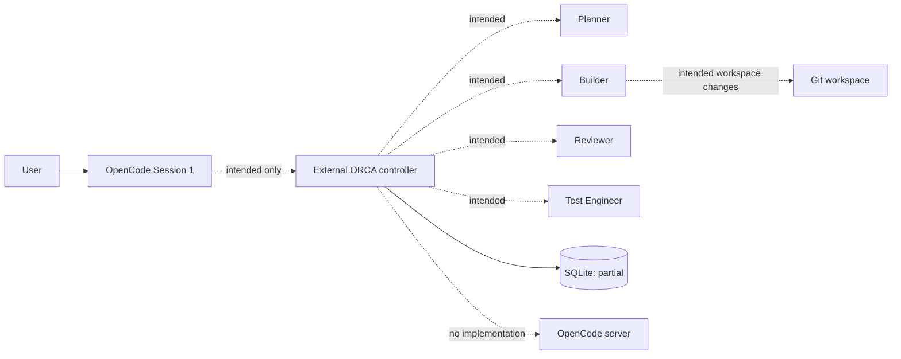
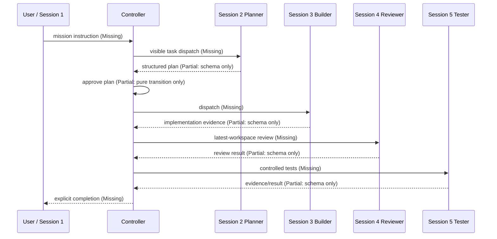
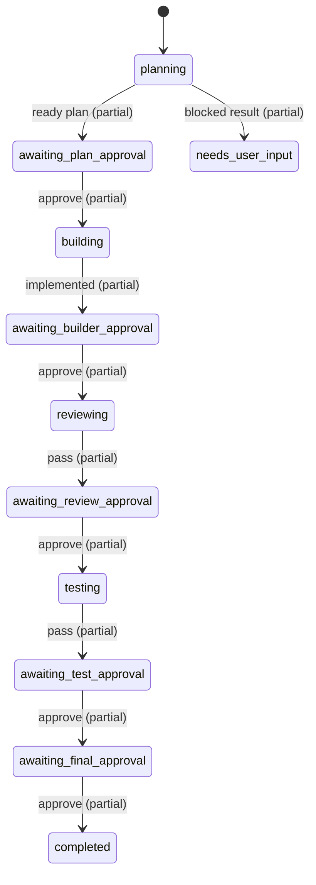

# ORCA Architecture

## 1. Executive Summary

**Overall status: Major architectural gaps.** ORCA is presently a TypeScript foundation, not an operational five-session controller. Verified code provides versioned CLI metadata, a host-agnostic OpenCode command-registration shape, strict task/result schemas, small workflow/approval helpers, and a SQLite wrapper with a basic outbox table. The controller entry point is an empty placeholder. Pairing, adapter calls, dispatch, role/skill installation, completion detection, API authentication, and recovery are not implemented. No real OpenCode five-session test was available or completed.

Claims in the plan and compatibility notes are treated as plans/spike evidence only unless linked below to executable source and tests.

## 2. Intended System Model

ORCA is intended to remain external to one OpenCode server and coordinate five manually opened sessions in one repository: (1) Orchestrator, (2) Planner, (3) Builder, (4) Reviewer, and (5) Test Engineer. The user selects each session's model and speaks only to Session 1. The controller must pair and preserve that roster, assign role instructions/skills once, dispatch visible work to the assigned tab, and enforce Plan → Build → Review → Test → explicit final approval. Only Builder may modify project files; workers must not communicate directly.

## 3. Current Repository Structure

```
src/cli/main.ts                 CLI metadata only
src/controller/main.ts          empty controller placeholder
src/domain/{types,schemas,workflow,policy}.ts  contracts and pure helpers
src/persistence/sqlite.ts       SQLite wrapper and migrations
src/integrations/opencode/types.ts  local integration abstraction
integrations/opencode/generated-entry.ts        command-registration metadata
tests/unit/*                    unit tests only
docs/superpowers/plans/*        implementation plan, not runtime code
```

`package.json` uses pnpm and TypeScript/tsup/Vitest/ESLint. `dist/` and `node_modules/` exist locally. The working tree already contained modifications to compatibility/plan documents and new untracked source/tests before this audit; they were not changed. Recent commits are `783dcbc docs: update task1 checklist` and `9319785 chore: establish orchestration project foundation`.

## 4. Runtime Architecture

The only executable CLI path is `src/cli/main.ts:buildCliProgram`, which creates `swarmctl` with no operational subcommands. `src/controller/main.ts:startControllerPlaceholder` is empty. `integrations/opencode/generated-entry.ts:registerIntegration` registers descriptive command metadata against a local `OpencodeRuntime` interface; it does not call an OpenCode server.



No controller/server/session transport, event subscription, stateful dispatcher, API, or Git/workspace integration exists.

## 5. Role and Skill Architecture

`Role` is a type union in `src/domain/types.ts`; it is not a role profile, permission system, or skill loader. No Agent Skills are installed or referenced by ORCA source (including no Addy Osmani collection reference). Models appear only in the unused `SessionBinding` type and are not configured or changed.

| Role | Intended responsibility | Current allowed/prohibited enforcement | Assigned skills / loading | Model handling |
|---|---|---|---|---|
| Orchestrator | delegate, approve, escalate, complete | Missing | Missing | Type only |
| Planner | discovery/decomposition | Missing | Missing | Type only |
| Builder | implementation/tests | Missing; no write restriction exists | Missing | Type only |
| Reviewer | read-only review | Missing | Missing | Type only |
| Test Engineer | read-only test evidence | Missing | Missing | Type only |

The result schemas distinguish worker roles, but no tool authorization prevents workers from invoking arbitrary capabilities or Reviewer/Tester from editing.

## 6. Session Pairing and Roster Integrity

`SessionBinding` declares position, role, model, project root/fingerprint, server URL, timestamps, prompt hash, and expected title (`src/domain/types.ts`). There is no pairing command, persistence table, repository/session inspection, uniqueness check, fixed-order validation, model recording, model-preservation logic, role-instruction application, or drift check. Thus every required roster guarantee is **Missing**, despite the presence of an illustrative type.

## 7. Mission Lifecycle

The lifecycle below is the intended flow; bold annotations show current status.



`nextMissionStateFromResult` validates the active state/role pairing and maps good role verdicts to approval states. `resolveMissionApproval` maps approval states forward. Neither function creates a mission, dispatches a task, validates workspace freshness, rejects a stale approval, or loops correction work to Builder.

## 8. Workflow State Machine

Defined mission states are in `src/domain/types.ts`; executable transitions are limited to `src/domain/workflow.ts` and `src/domain/policy.ts`.



There is no transition authority, persistence integration, retry loop, stale-approval invalidation, or invariant that only one mission is active. `nextTaskStateFromMissionState` incorrectly maps terminal `blocked` to `approved`, an unsafe semantic mismatch.

## 9. Task and Result Contracts

`TaskEnvelope` and role-specific result contracts are strict Zod schemas in `src/domain/schemas.ts`. They require IDs, role, objective, evidence categories, workspace fingerprint, and role verdict payloads. `parseWorkerResult` checks role/mission/task identity. Builder `implemented` requires changed files; Reviewer pass cannot carry blocking high/critical findings; Tester pass requires all named checks passed.

This is **Partial**: result validation is not connected to OpenCode output, a result channel, evidence verification, path validation, repair attempt, or controller policy. Planner fields do not require a `ready` status to match `planVerdict`; file/command evidence is declarative, not independently verified.

## 10. Completion Detection

**Missing.** No event handler, session status polling, tool-call tracker, idle/quiet window, timeout, disconnect handling, duplicate-event handling, session-closure handling, or result-repair flow exists. A valid `parseWorkerResult` call alone is insufficient and not invoked by runtime code. Idle events are not used, which avoids the specific single-idle-event defect only because no completion mechanism exists.

## 11. Approval and Quality Gates

**Partial, pure-logic only.** `resolveMissionApproval` encodes nominal gate order, and schemas reject a Reviewer pass containing a blocking high/critical finding and Tester pass lacking named required checks. There is no controller enforcement for authenticated Orchestrator approval, Planner-before-Builder dispatch, file/diff evidence, fingerprint freshness, unresolved tasks/permissions, roster/repository drift, explicit final approval origin, or prevention of prompt-based bypass. A Builder cannot currently approve itself only because no actor/action API exists—not because authorization is enforced.

## 12. Persistence and Recovery

`SqlitePersistence` opens SQLite with WAL and foreign keys and migrates `missions`, `tasks`, and `outbox_events`. `tasks.mission_id` has a foreign key; task IDs are primary keys; there are useful indexes. `runInTransaction` is exposed, but `saveMission`, `saveTaskEnvelope`, and `enqueueOutboxEvent` do not compose a mission transition and outbox write transaction. `markOutboxEventsPublished` is transactional only for marking. Persistence unit assertions were skipped in this environment because the test deliberately suppresses an unavailable `better-sqlite3` runtime import, so SQLite behavior is **Blocked from verification** here even though the implementation was read.

Missing: session bindings, approvals, event history, workspace snapshots, failure/recovery state, schema-versioned migrations, active-mission uniqueness, dispatch lease/idempotency key, outbox publisher, and restart recovery. The outbox lacks a uniqueness constraint or claim/lock state, so it cannot by itself prevent duplicate external dispatch after crash.

## 13. Security and Trust Boundaries

No Fastify server is instantiated despite the dependency. Therefore localhost binding, authentication, caller identity, only-Session-1 orchestration authorization, paired-worker validation, secret redaction, repository-root enforcement, controlled test execution, and permission-request escalation are **Missing**. There is no automatic Git commit/push/merge/reset/delete code, which is a verified absence rather than a control. `execa` is declared but unused. Role types/prompts must not be described as operating-system security controls.

## 14. Testing Architecture

All discovered tests are unit tests: `bootstrap.test.ts`, `domain-schemas.test.ts`, `domain-workflow.test.ts`, `opencode-compatibility.test.ts`, and `persistence.test.ts`. The compatibility test uses a stub `OpencodeRuntime`; it is a contract/unit fake, not an OpenCode integration. Script names reserve integration, contract, fake-E2E, and real-E2E lanes, but the corresponding directories/suites do not exist and `--passWithNoTests` makes those scripts pass without coverage.

Coverage exists for representative schema constraints, pure workflow transitions, persistence CRUD/outbox basics, CLI version metadata, and stub registration. Missing coverage includes pairing/model preservation/drift, dispatcher idempotency, completion detection, authentication/authorization, role isolation, controlled execution, recovery, mission happy path/correction loops, and real five-tab visibility.

## 15. Implemented Capability Matrix

| Capability | Status | Evidence | Tests | Gap |
|---|---|---|---|---|
| CLI/version metadata | Verified | `src/cli/main.ts` | bootstrap | no operational commands |
| OpenCode command metadata | Mock only | generated entry + local interface | compatibility stub | no real OpenCode contract/server call |
| Five-session pairing/roster | Missing | `SessionBinding` type only | none | all validation/persistence absent |
| Model preservation | Missing | model type only | none | no pairing/controller |
| Role/skill assignment | Missing | role union only | none | no profiles/installer |
| Builder-only writes/read-only roles | Missing | none | none | no tool permission enforcement |
| Structured contracts | Verified | Zod schemas | domain schemas | runtime not connected |
| Workflow transitions | Partial | pure helpers | domain workflow | no controller/state authority |
| Approval gates | Partial | pure helpers/schema checks | domain workflow/schemas | no actor/freshness/evidence enforcement |
| SQLite mission/task/outbox storage | Partial | `SqlitePersistence` | persistence | no session/approval/events/recovery |
| Transactional dispatch/outbox idempotency | Missing | table only | basic outbox test | no atomic workflow/publisher/lease |
| Completion detection | Missing | none | none | all mechanisms absent |
| Workspace/Git fingerprinting | Missing | field declarations only | none | no calculation/comparison |
| Controlled test execution | Missing | none | none | no allowlist/argv execution |
| Controller API/authz | Missing | placeholder only | none | no listener/auth/caller policy |
| Recovery | Missing | none | none | no reconstruction/duplicate prevention |
| Fake end-to-end | Missing | empty test lane | none | `passWithNoTests` masks absence |
| Real five-session E2E | Blocked from verification | no adapter/server/session config | none | runtime not implemented/available |

## 16. Architectural Findings

### Critical

- **ARC-001 — No operational controller.** Evidence: `src/controller/main.ts:startControllerPlaceholder` has an empty body; CLI exposes no controller command. Impact: none of the intended orchestration guarantees run. Recommended action: implement a single controller composition root and authenticated API before features. Affected: `src/controller/main.ts`, `src/cli/main.ts`.

- **ARC-002 — Roles and session isolation are declarations only.** Evidence: roles/session binding are TypeScript types only; no adapter, pairing, permission, or authorization implementation exists. Impact: Builder-only writes, read-only review/testing, roster order, model preservation, and no direct worker communication are unenforceable. Recommended action: implement paired-session registry plus controller-mediated, caller-authorized tools. Affected: `src/domain/types.ts` and missing adapter/pairing modules.

### High

- **ARC-003 — Completion and reliability mechanisms are absent.** Evidence: no event/polling/quiet-window/recovery code. Impact: a future controller could prematurely advance or duplicate work. Recommended action: build completion detector and durable dispatch/recovery before mission dispatch. Affected: missing controller/adapter/recovery modules.

- **ARC-004 — Persistence is incomplete for workflow safety.** Evidence: three-table SQLite schema has no session/approval/event/snapshot/recovery records or active-mission uniqueness; business writes are not bundled with outbox creation. Impact: restart and duplicate-dispatch guarantees cannot be made. Recommended action: versioned migration and transactional state/outbox repositories. Affected: `src/persistence/sqlite.ts`.

### Medium

- **ARC-005 — Tests can report green with absent integration/E2E suites.** Evidence: `test:integration`, `test:contract`, `test:e2e:fake`, and `test:e2e:real` use `--passWithNoTests`; no matching suites were discovered. Impact: package verification overstates runtime confidence. Recommended action: fail CI when required suite directories are absent once those lanes become required. Affected: `package.json`.

- **ARC-006 — Terminal task mapping is semantically unsafe.** Evidence: `nextTaskStateFromMissionState` returns `approved` for any terminal mission state, including `blocked`, `failed`, and `cancelled`. Impact: callers may misrepresent non-successful work as approved. Recommended action: define explicit terminal task mapping and test it. Affected: `src/domain/workflow.ts`.

### Low

- **ARC-007 — Documentation is currently mostly placeholders/plans.** Evidence: prior `docs/architecture.md` and `docs/operations.md` were placeholders; plan checkboxes describe future work. Impact: readers can confuse intended design with execution. Recommended action: retain this audit as the source of current-state truth. Affected: `docs/architecture.md`, `docs/operations.md`, plan document.

## 17. Gap Analysis

**Functional gaps:** controller/CLI commands; real adapter; pairing; role profiles/skills; mission/task services; dispatch; approval action API; diff/test evidence; correction loops; completion.

**Reliability gaps:** durable event intake, polling fallback, quiet window, timeout/repair policy, idempotency, transactional outbox use, workspace fingerprints, recovery, one-active-mission constraint.

**Security gaps:** localhost/auth/caller authorization, repository containment, command allowlists/argv execution, permission handling, logging/redaction, enforced read-only capabilities.

**Testing gaps:** every integration/contract/E2E lane, recovery/idempotency/auth/role-isolation tests, real OpenCode visual test.

**Documentation gaps:** operations/runbook and validated OpenCode integration contract.

## 18. Prioritized Remediation Plan

1. **Blocking architecture corrections (P0):** create controller composition root, paired-session registry, adapter boundary, and authenticated controller actions; likely `src/controller/*`, `src/integrations/opencode/*`, `src/pairing/*`; depends on validated OpenCode API; tests: contract/auth/pairing; done when Session 1 alone can create a durable mission against five verified sessions.
2. **Core workflow completion (P0):** implement transaction-owned mission/task services, role permissions, dispatch, result ingestion, evidence/fingerprint gates, and correction loops; likely `src/workflow/*`, `src/domain/*`, `src/persistence/*`; depends on phase 1; tests: fake mission happy/correction loops; done when controller—not prompts—blocks all skipped gates.
3. **Reliability and recovery (P0):** add events, durable outbox leases/idempotency, completion detector, recovery, and one-active-mission rule; tests: crash/replay/duplicate/timeout/disconnect; done when restart cannot duplicate dispatch or complete on idle alone.
4. **Security hardening (P1):** localhost binding, secret-redacting logs, caller/session validation, root-constrained files, configured argv test runner, user-involved dangerous permissions; tests: authz/path/command/redaction; done when unpaired/worker callers cannot invoke orchestrator or write tools.
5. **Real OpenCode validation (P1):** verify adapter against a running server and five manually opened, user-model-selected sessions; tests: real visible-tab E2E; done when a full mission including a correction loop is observed.
6. **Documentation and packaging (P2):** operational runbook, compatibility matrix, release/diagnostic commands, and trustworthy test-lane policy; depends on phases 1–5; done when docs cite real validated behavior.

## 19. Verification Evidence

Commands run during this audit (PowerShell, repository root):

| Command | Exit code | Result |
|---|---:|---|
| `Get-ChildItem -Force ...` | 0 | repository tree and existing docs inspected |
| `rg --files -g '!node_modules' -g '!dist'` | 0 | source/test inventory captured |
| `Get-Content -Raw package.json; git status --short; git log --oneline -5` | 0 | scripts and Git state inspected |
| `Get-Content -Raw` on core source, integration, persistence, docs | 0 | entry points/contracts/schema verified |
| `Get-Content -Raw README.md; ...plan...; ...workflow test...` | 124 | timed out after outputting partial plan/test evidence; not treated as successful validation |

| `pnpm run lint` | 0 | ESLint passed |
| `pnpm run typecheck` | 0 | TypeScript check passed |
| `pnpm run test:unit` | 0 | 4 files passed; persistence suite skipped; 28 passed / 4 skipped |
| `pnpm run test:integration` | 0 | no tests found; `--passWithNoTests` |
| `pnpm run test:contract` | 0 | no tests found; `--passWithNoTests` |
| `pnpm run test:e2e:fake` | 0 | no tests found; `--passWithNoTests` |
| `pnpm run test:e2e:real` | 0 | no tests found; `--passWithNoTests`; no real OpenCode test |
| `opencode --version` | 0 | OpenCode CLI version `1.18.3`; this does not establish a running server or five paired sessions |
| `git diff --check -- docs/architecture.md` | 0 | no whitespace errors in this audit document |

`pnpm install` and `pnpm run build` were not run during the audit: installation is a dependency mutation and the tsup configuration uses `clean: true`, so build may overwrite the pre-existing `dist/` output in a dirty working tree. The attempted combined mutation request was rejected by the execution safety gate and was not retried. OpenCode CLI version was verified, but server/session information could not be verified because no executable adapter, server configuration, or running-session evidence was present. The skipped SQLite tests report that `better-sqlite3` lacks the native binding for Node ABI `node-v137-win32-x64`.

## 20. Open Questions

- What is the authoritative OpenCode plugin/tool/session API and its stable event/status semantics?
- Which durable store location, authentication secret source, and configured test-command allowlist are intended for deployment?
- Which specific Agent Skills (including any Addy Osmani skills) should be installed per role after an approved role-profile design?

## 21. Final Assessment

The repository is suitable as a narrowly scoped TypeScript foundation, but not yet suitable to continue feature development that depends on the five-session architecture. Before new mission features, implement the controller/adapter/pairing/authorization and durable workflow-completion core (phases 1–3). Documentation polish and packaging can be deferred. No real five-session OpenCode test has been completed.
